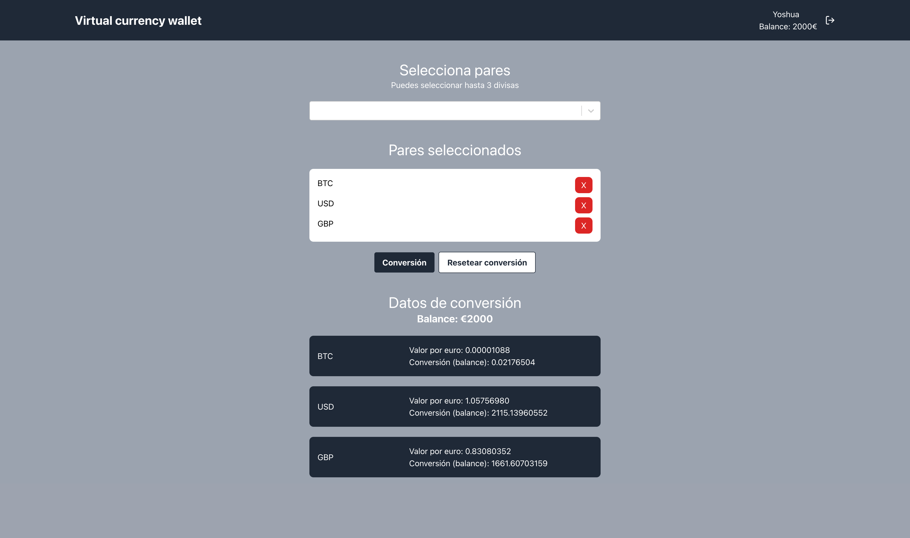

# Virtual wallet

Aplicación web básica en React.js que permite a los usuarios gestionar un
saldo en euros (EUR) y visualizar su equivalente en otras divisas utilizando la API de
Coinbase.

## Project setup
`npm install`

## Compiles  for development
`npm start`

## Build for production
`npm run build`
